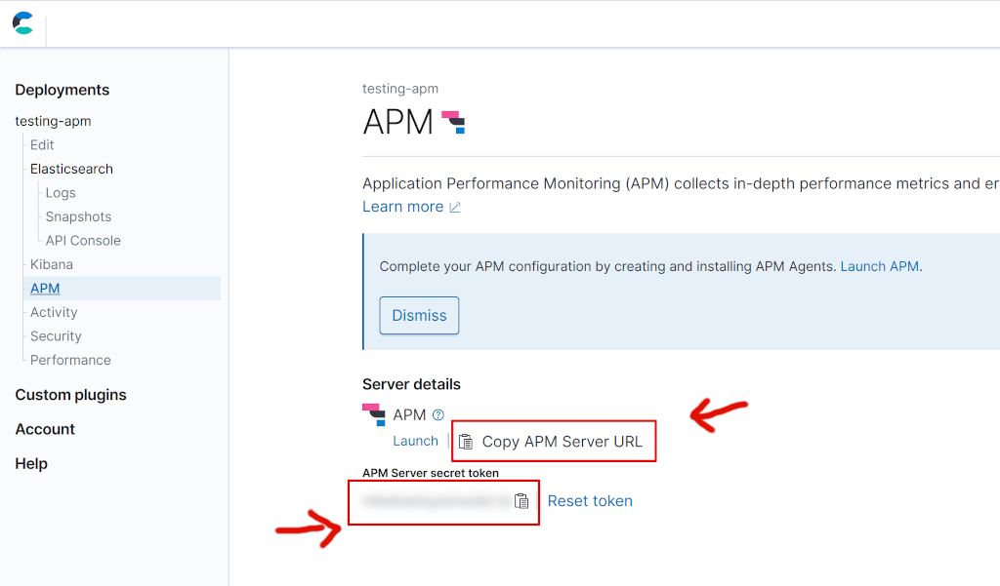

# Elastic APM Agent for PHP

The official PHP agent for [Elastic APM](https://www.elastic.co/products/apm).
This agent is a PHP extension that must be installed in your PHP environment.

## Usage

You need to compile and install this library as PHP extension.
At the moment, this extension is only available for Unix like OS.
To install the extension you need to execute the command as follows:

```bash
cd src/ext
phpize
./configure --enable-elasticapm
make clean
make
sudo make install
```

You need to enable the extension in your `php.ini`. You need to add the following
line to `php.ini`:

```
extension=elasticapm.so
elasticapm.bootstrap_php_part_file=<repo root>/src/bootstrap_php_part.php
```

### Local development

If you don't want to install any of the dependencies you might need to compile and install the library then you can use the Dockerfile.


```bash
docker build --tag test-php .

## To compile the library
docker run --rm -ti -v $(pwd):/app test-php

## To test the Library
docker run --rm -ti -v $(pwd):/app test-php make test

## To install the library
docker run --rm -ti -v $(pwd):/app test-php make install
```

## Configure

You can configure the Elastic APM agent using the following ini settings for PHP:

```ini
elasticapm.host = localhost:8200
elasticapm.service_name = My_PHP_service
```

By default, the extension is enabled. You can disable it by setting `elasticapm.enabled=false`.

The agent supports logging to the following sinks: file, syslog and stderr.
You can control level of logging either for individual sinks using
`elasticapm.log_level_file`, `elasticapm.log_level_syslog` and `elasticapm.log_level_stderr` keys
or using fallback setting `elasticapm.log_level`
which has effect for sink xyz when the more specific `elasticapm.log_level_xyz` option is not set.   
The log levels are:
```
OFF
CRITICAL
ERROR
WARNING
NOTICE
INFO
DEBUG
TRACE
```
E.g. if you specify `WARNING`, logging statements with levels `NOTICE`, `INFO`, `DEBUG` and `TRACE`
will be ignored.

In order to enable logging to a file you need to specify a file path in `elasticapm.log_file`. 
The default log level for file logging sink (which can be controlled using `elasticapm.log_level_file` key)
is `INFO`. 

You can see an example of `elasticapm.ini` [here](src/ext/elasticapm.ini).

If you want you can also change the Elastic APM agent configuration at runtime, using the
following PHP code:

```php
ini_set('elasticapm.server_url', 'http://myhost:8200');
ini_set('elasticapm.service_name', 'test');
ini_set('elasticapm.log_file', '/tmp/elasticapm.log');
ini_set('elasticapm.log_level', 'WARNING');
```

## Configure with Elastic Cloud

You can also configure the PHP agent to send data to an [Elastic Cloud](https://www.elastic.co/cloud/)
APM instance. You just need to configure the `elasticapm.host` and `elasticapm.secret_token`.

The `server_url` and `secret_token` are available in the APM section of Elastic Cloud
(see the image below):



You can set the host and the secret token using the following PHP code:

```php
ini_set('elasticapm.server_url', 'insert your APM Server URL here');
ini_set('elasticapm.secret_token', 'insert your token here');
```

or using the `elasticapm.ini` settings:

```ini
elasticapm.host=insert here the host URL
elasticapm.secret_token=insert here you token
```

## Note

**This project is still in development. Please do not use in a production environment!**

## Authors

- [Enrico Zimuel](https://www.zimuel.it)
- [Philip Krauss](https://github.com/philkra)

## Copyright

Copyright 2019 Elasticsearch BV.
Licensed under the [Apache License, Version 2.0](LICENSE).
